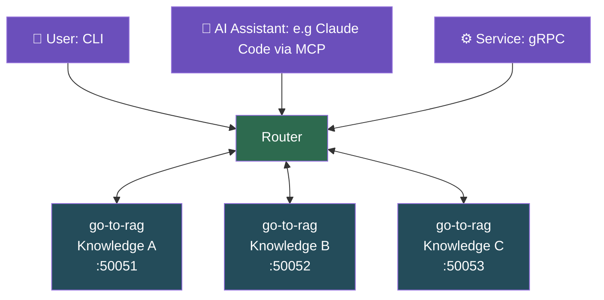

# go-to-rag


A local RAG (Retrieval-Augmented Generation) engine written in Go, powered by [Ollama](https://ollama.com). 

Seed, embed, and query a knowledge base entirely on-device. 

Access the pipeline through the CLI, connect it to Claude or any MCP-compatible LLM via the built-in [MCP](docs/mcp.md) server, or integrate service-to-service over [gRPC](docs/serve.md) with native token streaming.

## Requirements

- Go 1.25+
- [Ollama](https://ollama.com) 0.5+, running locally
- Models pulled:

```bash
ollama pull llama3.2:1b
ollama pull mxbai-embed-large:latest
```

## Quick start

Once the models are pulled (see Requirements above), seed a K8s/OLM/OpenShift knowledge base and ask your first question in one shot:

```bash
make run-demo    # seed docs, embed into SQLite, and ask a question
```

Or step through the pipeline manually:

```bash
make build
./bin/go-to-rag seed                      # download K8s/OLM/OpenShift docs to ./seeds
./bin/go-to-rag ingest                    # chunk, embed, and index into SQLite
./bin/go-to-rag ask "What does OLM do?"   # retrieve context and stream the answer
```

See [docs/quickstart.md](docs/quickstart.md) for the full pipeline walkthrough and flag reference.

## Commands

| Command | Description |
|---------|-------------|
| `ask <prompt>` | RAG-augmented question, retrieves relevant chunks and streams the answer |
| `seed [dir]` | Download K8s/OLM/OpenShift docs for ingestion (default: `./seeds`) |
| `ingest [path]` | Chunk, embed, and index documents into SQLite (default: `./seeds`) |
| `mcp` | Start the MCP server for external LLM integration (stdio by default, SSE with `--addr`) |
| `serve` | Start the gRPC server (default `:50051`); exposes `Ask` (streaming) and `RetrieveChunks` RPCs |

## Stack

| Component | Choice | Rationale |
|-----------|--------|-----------|
| Language | Go | Fast, compiled, good fit for systems tooling |
| Embeddings | `mxbai-embed-large:latest` via Ollama | Local, no API keys, 1024-dim vectors |
| Vector store | SQLite (WAL mode) | Zero-dependency MVP; swappable via `Store` interface |
| Chat | Ollama (local) | Self-contained, fully local inference |
| MCP SDK | [`modelcontextprotocol/go-sdk`](https://github.com/modelcontextprotocol/go-sdk) | Official Go MCP SDK for tool registration, stdio and SSE transport |
| gRPC | `google.golang.org/grpc` + protobuf | RPC interface for service-to-service and programmatic access |
| Protobuf | `buf` CLI | Schema definition, linting, and Go stub generation |
| CLI | Cobra | Subcommand structure with per-command flags |

## Models

The default chat model (`llama3.2:1b`) is intentionally small for fast iteration on development hardware. Additional pre-tuned Modelfiles are in [`modelfiles/`](modelfiles/README.md).

To switch models, update the `MODELFILE` variable at the top of the `Makefile` to point to the desired Modelfile, then run `make model-create` to rebuild.

## Docker

Build and run the full pipeline in a container (requires Ollama on the host). Auto-detects podman (Default) or docker:

```bash
make docker-demo

# Override the prompt or force a specific runtime:
make docker-demo DEMO_PROMPT="What is a CRD?"
make docker-demo CONTAINER_TOOL=docker
```

## Project Roadmap

Next up: **Multi-agent Compose** - domain-scoped RAG agents behind a
router with concurrent fan-out queries.

The gRPC layer provides the service-to-service backbone: each domain agent is a
`go-to-rag` instance serving its own knowledge base over gRPC, and the router
fans out queries to all agents in parallel, merging their streamed responses.


Access the router through any entry point - CLI, MCP, or gRPC. 
Under the hood, the router fans out to each domain agent over gRPC, querying their knowledge bases in parallel and merging the results.



## Contributing

Issues and PRs welcome. Use [GitHub Issues](https://github.com/DanielBlei/go-to-rag/issues) for bugs, features, and questions.

## License

[Apache 2.0](LICENSE)
