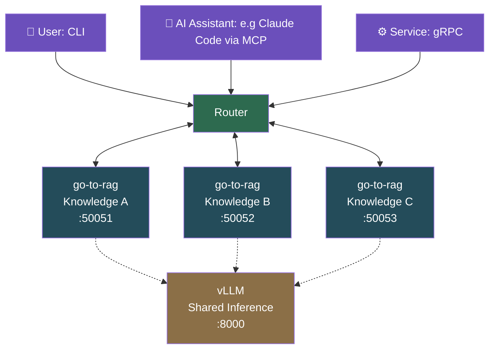

# go-to-rag


A production-grade RAG pipeline in Go. Embed a document corpus, retrieve relevant context, and stream answers from any OpenAI-compatible LLM.  

Runs fully local with [Ollama](https://ollama.com). Scales to shared-GPU deployments with [vLLM](https://docs.vllm.ai). Query through the CLI, connect any MCP client via the built-in [MCP server](docs/mcp.md), or integrate service-to-service over [gRPC](docs/serve.md) with native token streaming.

## Requirements

- Go 1.25+
- [Ollama](https://ollama.com) 0.5+ (default inference backend)

Pull the default models before running:

```bash
ollama pull qwen3:1.7b                # chat
ollama pull mxbai-embed-large:latest  # embeddings
```

To use [vLLM](https://docs.vllm.ai) instead, pass `--inference vllm` with `--chat-host`, `--embed-host`, and `--embed-model`. See [docs/vllm.md](docs/vllm.md).

## Quick start

Seed a K8s/OLM/OpenShift knowledge base and ask your first question:

```bash
make run-demo    # seed docs, embed into SQLite, and ask a question
```

Or step through the pipeline manually:

```bash
make build
./bin/go-to-rag seed                      # download K8s/OLM/OpenShift docs to ./seeds
./bin/go-to-rag ingest                    # chunk, embed, and index into SQLite
./bin/go-to-rag ask "What does OLM do?"   # retrieve context and stream the answer
```

See [docs/quickstart.md](docs/quickstart.md) for the full walkthrough, including how to use your own documents.

## Commands

| Command | Description |
|---------|-------------|
| `ask <prompt>` | RAG-augmented question — retrieves relevant chunks and streams the answer |
| `seed [dir]` | Download K8s/OLM/OpenShift docs for ingestion (default: `./seeds`) |
| `ingest [path]` | Chunk, embed, and index documents into SQLite (default: `./seeds`) |
| `eval` | Assert retrieval quality against a golden query set and produce a reproducible report |
| `mcp` | Start the MCP server — exposes the pipeline as tools to Claude or any MCP-compatible LLM |
| `serve` | Start the gRPC server (default `:50051`) for service-to-service integration |

## Stack

| Component | Choice | Rationale |
|-----------|--------|-----------|
| Language | Go | Compiled, low-overhead, good fit for systems tooling |
| Embeddings | configurable via `--embed-model` | Pluggable; defaults to `mxbai-embed-large:latest` |
| Vector store | SQLite (WAL mode) | Zero-dependency embedded storage; swappable via `Store` interface |
| Inference | Ollama · vLLM | `--inference` flag; Ollama for local dev, vLLM for shared-GPU deployments |
| MCP SDK | [`modelcontextprotocol/go-sdk`](https://github.com/modelcontextprotocol/go-sdk) | Official Go MCP SDK; stdio and SSE transport |
| gRPC | `google.golang.org/grpc` + protobuf | Typed RPC interface for service-to-service and programmatic access |
| Protobuf | `buf` CLI | Schema definition, linting, and Go stub generation |
| CLI | Cobra | Subcommand structure with per-command flags |

## Safety

Two layers of indirect prompt injection mitigation (OWASP LLM02):

- **`InjectionGuard`** — a `ChatServer` decorator applied automatically in `Ask()`. Sanitises embedded sentinel strings, frames the context block with trust boundary markers, and appends an untrusted-data notice to the system prompt. Covers all entry points with no per-transport opt-in required.
- **MCP structured envelope** — `check_rag_knowledge_base` returns a JSON object with a `_data_notice` sentinel and per-chunk attribution and confidence scores rather than raw text.

> **Note:** Sentinel strings are fixed in source — this mitigates naïve injection, not targeted attacks. A per-request nonce would be stronger and is a known future direction. Prompt guardrails (input/output validation) would follow the same `ChatServer` decorator pattern.

## Models

The default chat model (`qwen3:1.7b`) runs on consumer hardware and supports chain-of-thought reasoning via `--think`. Additional pre-tuned Modelfiles that add a RAG-specific system prompt are in [`modelfiles/`](modelfiles/README.md).

> **Note:** Out-of-the-box Ollama models are not tuned for RAG. For best results, use one of the provided Modelfiles — `make model-create` builds `go-to-rag:latest` from the default.

## Evaluation

`eval` measures retrieval quality before you rely on the pipeline. It runs assertion-based metrics (Hit@K, MRR, Precision@K, Recall@K) against a frozen corpus and a golden query set: no judge model, no external calls beyond the embedding model, and the same inputs always produce the same numbers.

```bash
make eval    # zero-config text report against the bundled K8s corpus
```

Use the metric deltas to validate changes to chunk size, overlap, or embedding model before committing them. An LLM Judge tier for answer correctness and faithfulness scoring is planned once the assertion baseline is stable. See [docs/eval.md](docs/eval.md) for methodology and a full sample report.

## Docker

Requires Ollama running on the host. Auto-detects podman (preferred) or docker:

```bash
make docker-demo

# Overrides:
make docker-demo DEMO_PROMPT="What is a CRD?"
make docker-demo EMBED_MODEL=mxbai-embed-large:latest CONTAINER_TOOL=docker
```

To pass flags directly to the binary:

```bash
docker run --rm --network host go-to-rag:latest ask "What is a CRD?"
```

## Project Roadmap

### Multi-agent Compose

Domain-scoped RAG agents behind a router with concurrent fan-out queries.

The gRPC layer provides the service-to-service backbone: each domain agent is a `go-to-rag` instance serving its own knowledge base, and the router fans out queries to all agents in parallel, merging their streamed responses. Each agent can share a vLLM process via `--inference vllm`, making efficient use of GPU resources across the fleet.



## Contributing

Issues and PRs welcome. Use [GitHub Issues](https://github.com/DanielBlei/go-to-rag/issues) for bugs, features, and questions.

## License

[Apache 2.0](LICENSE)
